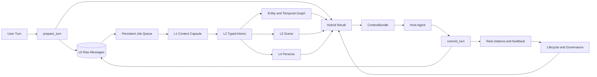

# ALTM: Autonomous Long-Term Memory

<div align="center">

**面向 Agent 的本地优先、分层、可追溯长期记忆运行时**

[](https://github.com/cuiyuestar/Autonomous-Long-Term-Memory-System)
[](https://www.python.org/)
[](https://github.com/cuiyuestar/Autonomous-Long-Term-Memory-System/actions/workflows/ci.yml)
[](https://modelcontextprotocol.io/)
[](LICENSE)

[快速开始](#快速开始) · [核心能力](#核心能力) · [Agent-接入](#agent-接入) · [MCP-接入](#mcp-接入) · [Host-适配器](#host-适配器) · [评估](#评估)

</div>

---

## 项目简介

ALTM（Autonomous Long-Term Memory）不是聊天记录仓库，也不是把全部历史切片后堆进向量数据库的检索包装器。它是一个独立的 Agent Memory Runtime，负责在 Host Agent 之外完成：

- 原始对话的无损持久化；
- 分层语义折叠与证据抽取；
- 场景、画像和异构图的持续形成；
- FTS、向量、Graph PPR 与 RRF 融合召回；
- 生命周期晋升、降级、压缩、保留与删除；
- 向 Agent 注入受预算约束、可下钻、可验证的上下文；
- 将 Agent 的真实引用和用户反馈写回记忆生命周期。

核心回合协议只有两步：

```text
prepare_turn -> Host Agent 生成真实回复 -> commit_turn
```

ALTM 不生成模板 Assistant 回复，不把全部注入内容伪装成已引用，也不会在语义模型缺失时用规则输出冒充 LLM 判断。

## 为什么使用 ALTM

传统 Agent Memory 常见的失效模式包括：

| 失效模式 | ALTM 的处理方式 |
|---|---|
| 原始事实被摘要覆盖，无法追溯 | L0 append-only；所有高层记忆保留 evidence refs |
| 向量召回只找到相似文本，缺少关系和时间 | Entity/Task/Intent/Time 异构图 + scoped PPR |
| 全部历史直接塞入 Prompt | ContextBundle、token budget、ContentRouter、CCR |
| 多 Agent 数据串扰 | `tenant/workspace/user/agent` 四级隔离 |
| 用户画像被一次临时要求污染 | 跨 session/Agent 证据门 + L4 observation |
| 新旧画像同时生效 | `facet_key` 单 current 约束 + 高置信 supersede |
| LLM 不可用时执行危险治理动作 | fail-closed：P0 语义动作延后，不规则兜底 |
| “被注入”被误算为“被使用” | `injected` 与 `cited_by_agent` 独立记录 |

## 30 秒架构



### 记忆分层

| 层级 | 语义 | 默认可见性 | 形成方式 |
|---|---|---|---|
| L0 | 原始用户、Assistant、Tool 消息 | Agent 私有 | append-only capture |
| L1 | 会话上下文胶囊 | Agent 私有 | 增量 LLM summarization |
| L2 | preference、decision、issue、task 等原子事实 | Agent 私有 | 结构化 LLM extraction |
| L3 | 项目、任务、主题、关系、工作流 Scene | Agent 私有 | embedding candidates + 多模型 Gate |
| L4 | 稳定用户画像 Persona Facet | 同用户工作区共享 | 跨 session/Agent 证据 + observation |

L0-L3 默认隔离到 `agent_id`。L4 仅在相同 `tenant_id / workspace_id / user_id` 内跨 Agent 共享。

## 核心能力

### 真实运行时协议

- `prepare_turn` 原子写入用户消息、召回上下文和 runtime cycle。
- `commit_turn` 只接受 Host Agent 的真实回复。
- 引用 ID 必须来自本轮 prepared context，否则提交失败。
- prepare/commit 均支持幂等重试和内容冲突检测。
- SQLite job queue 提供 lease、retry、dedupe 和 checkpoint。

### 分层语义形成

- L1/L2 使用真实 OpenAI-compatible Chat API。
- L3/L4 使用并行 reranker、NLI、scope classifier 和层级 Rubric。
- Semantic Gate 缺模型、低置信、非法输出时保持 fail-closed。
- L3/L4 使用 typed table + `MemoryUnit` 双写。
- L4 高置信新证据覆盖时保留写前快照、旧证据和 `SUPERSEDES` 链。

### 混合检索

- SQLite FTS5 `unicode61` 与 trigram。
- 本地 lexical vector。
- OpenAI-compatible embedding + sqlite-vec cosine index。
- Entity/Temporal 图入口。
- Personalized PageRank 与最短相关子图解释。
- remote vector、local vector、FTS、Graph PPR 通过标准 RRF 融合。
- RRF 支持同内容并列排名，避免状态标签造成隐式降权。

### 生命周期与上下文控制

- 动态 promotion/demotion threshold。
- age table、promotion failure、连续周期门、证据质量和冲突门。
- L0 默认永久保留；支持 TTL、用户删除和法规删除。
- C0-C4 压缩生命周期。
- ContentRouter 按 JSON、代码、日志、自然语言选择压缩器。
- CCR 保存压缩前原文，可通过 `memory://<id>#<hash>` 下钻。

### 安全与治理

- SQLite WAL、busy timeout、事务化批量写入。
- 远程 MCP 使用 SHA-256 API Key、scope 或自定义 OIDC/JWT verifier。
- runtime/admin MCP profile 隔离。
- 显式 deletion request、tombstone、物理删除和 evidence fallback repair。
- 召回内容按“不可信历史证据”注入，避免记忆中的指令直接成为系统指令。

## 快速开始

### 环境要求

| 依赖 | 要求 |
|---|---|
| Python | 3.11 或更高 |
| SQLite | 支持 FTS5 |
| LLM API | OpenAI-compatible Chat API |
| Embedding API | OpenAI-compatible Embeddings API |
| MCP | 可选，安装 `mcp` extra |

### 安装

```bash
git clone https://github.com/cuiyuestar/Autonomous-Long-Term-Memory-System.git
cd Autonomous-Long-Term-Memory-System

python3.11 -m venv .venv
.venv/bin/python -m pip install -e ".[mcp]"

cp .env.example .env
```

至少配置共享 Chat Model 与 Embedding Model：

```bash
export ALTM_LLM_BASE_URL="https://provider.example.com/v1"
export ALTM_LLM_API_KEY="your-api-key"
export ALTM_LLM_MODEL="your-chat-model"

export ALTM_EMBEDDING_BASE_URL="https://provider.example.com/v1"
export ALTM_EMBEDDING_API_KEY="your-api-key"
export ALTM_EMBEDDING_MODEL="your-embedding-model"
```

初始化数据库：

```bash
.venv/bin/altm init-db --db ./data/altm.sqlite3
```

所有可配置项见 [.env.example](.env.example)。L1、L2、Graph、Governance、reranker、NLI、scope、L3、L4 和 Headroom 均支持阶段级模型覆盖。

## Agent 接入

### Python

```python
from altm.application import AltmApplication

app = AltmApplication("./data/altm.sqlite3")

prepared = app.prepare_turn(
    tenant_id="tenant-1",
    workspace_id="workspace-1",
    user_id="user-1",
    agent_id="agent-1",
    session_id="session-1",
    turn_id="turn-1",
    content="我们决定在 9 月 1 日前发布 ALTM。",
    token_budget=1200,
)

# 由你的 Host Agent 使用 prepared.context 调用真实模型。
assistant_content = host_agent.generate(prepared.context)

committed = app.commit_turn(
    tenant_id="tenant-1",
    workspace_id="workspace-1",
    user_id="user-1",
    agent_id="agent-1",
    cycle_id=prepared.cycle_id,
    assistant_content=assistant_content,
    cited_memory_ids=host_agent.cited_memory_ids,
)
```

`cited_memory_ids` 必须是 Host Agent 实际使用的记忆，不应传入全部 context IDs。

### CLI

Prepare：

```bash
.venv/bin/altm prepare-turn \
  --db ./data/altm.sqlite3 \
  --tenant-id tenant-1 \
  --workspace-id workspace-1 \
  --user-id user-1 \
  --agent-id agent-1 \
  --session-id session-1 \
  --turn-id turn-1 \
  --content "我们决定在 9 月 1 日前发布 ALTM。"
```

Commit：

```bash
.venv/bin/altm commit-turn \
  --db ./data/altm.sqlite3 \
  --tenant-id tenant-1 \
  --workspace-id workspace-1 \
  --user-id user-1 \
  --agent-id agent-1 \
  --cycle-id "<cycle_id>" \
  --assistant-content "发布截止日期是 9 月 1 日。" \
  --cited-memory-id "<实际引用的 memory_id>"
```

运行后台 worker：

```bash
.venv/bin/altm worker \
  --db ./data/altm.sqlite3 \
  --worker-id worker-1
```

生产环境应以守护进程方式持续运行一个或多个 worker。任务通过 SQLite lease 协调，不需要额外队列服务。

## MCP 接入

### 本地 stdio

启动 runtime profile：

```bash
.venv/bin/altm mcp-server \
  --db ./data/altm.sqlite3 \
  --transport stdio \
  --profile runtime
```

通用 MCP Client 配置示例：

```json
{
  "mcpServers": {
    "altm": {
      "command": "/absolute/path/to/.venv/bin/altm",
      "args": [
        "mcp-server",
        "--db",
        "/absolute/path/to/data/altm.sqlite3",
        "--transport",
        "stdio",
        "--profile",
        "runtime"
      ]
    }
  }
}
```

runtime profile 只暴露：

```text
memory_prepare_turn
memory_commit_turn
memory_mvp_chat
memory_drilldown
memory_feedback
memory_pin
memory_unpin
memory_delete
```

治理、索引、回滚和兼容 review 工具只在 `--profile admin` 下提供。

### 远程 Streamable HTTP

服务端只保存 API Key 的 SHA-256：

```bash
export ALTM_MCP_API_KEY_SHA256="$(
  printf '%s' 'your-runtime-secret' | shasum -a 256 | awk '{print $1}'
)"

.venv/bin/altm mcp-server \
  --db ./data/altm.sqlite3 \
  --transport streamable-http \
  --profile runtime \
  --host 127.0.0.1 \
  --port 8000
```

多 Key 和 scope 使用 `ALTM_MCP_API_KEYS_JSON`。企业 OIDC/JWT 可通过 `ALTM_MCP_TOKEN_VERIFIER_FACTORY=module.path:factory` 接入。

详细协议、幂等语义和失败模式见 [Agent Runtime Protocol](docs/agent-runtime-protocol.md)。

## Host 适配器

### TypeScript SDK

SDK 源码位于 [`adapters/typescript`](adapters/typescript)，包名为 `@altm/sdk`。

```typescript
import {
  AltmRuntimeClient,
  AltmTurnCoordinator,
  StreamableHttpToolCaller
} from "@altm/sdk";

const caller = await StreamableHttpToolCaller.connect({
  url: "http://127.0.0.1:8000/mcp",
  apiKey: process.env.ALTM_API_KEY
});

const coordinator = new AltmTurnCoordinator(
  new AltmRuntimeClient(caller)
);

const turn = await coordinator.prepare({
  scope: {
    tenantId: "tenant-1",
    workspaceId: "workspace-1",
    userId: "user-1",
    agentId: "agent-1"
  },
  sessionId: "session-1",
  turnId: crypto.randomUUID(),
  content: "What is our release deadline?"
});

const answer = await hostAgent.generate(turn.injectedContext);
await coordinator.commit({
  prepared: turn.prepared,
  assistantContent: answer
});
```

Coordinator 只从 Assistant 输出中的真实 `memory://...` marker 推断引用；支持结构化引用的 Host 应显式传入 `citedMemoryIds`。

### OpenClaw

OpenClaw lifecycle adapter 位于 [`adapters/openclaw`](adapters/openclaw)，目标包名为 `@altm/openclaw`。它通过：

```text
before_prompt_build -> memory_prepare_turn
agent_end           -> memory_commit_turn
```

完成自动召回和回写，并跳过 incognito session。配置字段包括 MCP endpoint、API Key 和稳定的 tenant/workspace/user IDs。

本仓库只提供 adapter 源码与 manifest；OpenClaw 运行验证应在允许安装 OpenClaw 的合规环境完成。

### Hermes

Hermes adapter 位于 [`adapters/hermes`](adapters/hermes)。先把 ALTM 注册为 Hermes MCP Server：

```yaml
mcp_servers:
  altm:
    url: "http://127.0.0.1:8000/mcp"
    headers:
      Authorization: "Bearer ${ALTM_API_KEY}"
    tools:
      include:
        - memory_prepare_turn
        - memory_commit_turn
```

安装并启用插件：

```bash
cp -R adapters/hermes ~/.hermes/plugins/altm-memory
hermes plugins enable altm-memory
```

插件使用 `pre_llm_call` 注入 ContextBundle，并在 `post_llm_call` 提交真实 Assistant 回复和 marker 引用。

## 配置模型

所有模型均使用 OpenAI-compatible API。阶段配置为空时继承 `ALTM_LLM_*`：

| 阶段 | 环境变量前缀 | 用途 |
|---|---|---|
| L1 | `ALTM_L1_LLM_*` | 会话上下文胶囊 |
| L2 | `ALTM_L2_LLM_*` | 原子事实抽取 |
| Graph | `ALTM_GRAPH_LLM_*` | Entity/Task/Intent/Time 图 |
| Governance | `ALTM_GOVERNANCE_LLM_*` | 自治治理裁决 |
| Reranker | `ALTM_RERANKER_LLM_*` | 语义候选重排 |
| NLI | `ALTM_NLI_LLM_*` | entail/contradict/neutral |
| Scope | `ALTM_SCOPE_LLM_*` | session/project/workspace 边界 |
| L3 | `ALTM_L3_LLM_*` | Scene Rubric 与合成 |
| L4 | `ALTM_L4_LLM_*` | Persona Rubric、合成与覆盖 |
| Headroom | `ALTM_HEADROOM_LLM_*` | 自然语言压缩 |

关键非模型配置：

| 变量 | 默认值 | 说明 |
|---|---:|---|
| `ALTM_SEMANTIC_MIN_SCORE` | `0.80` | 语义 Gate 最低置信度 |
| `ALTM_L4_OVERWRITE_MIN_CONFIDENCE` | `0.90` | L4 覆盖阈值 |
| `ALTM_L0_RETENTION_DAYS` | `0` | `0` 表示永久保留 |
| `ALTM_LONG_MEMORY_TOKEN_BUDGET` | `100000` | 长期记忆预算 |
| `ALTM_CONTEXT_TOKENIZER` | `tiktoken` | 可选精确 token 预算 |

## 数据与安全边界

1. 所有 MemoryUnit 都带显式 scope。
2. L4 共享不会放宽 L0-L3 的 Agent 私有边界。
3. 远程 transport 必须认证；stdio 仅用于本地可信进程。
4. API Key 明文只存在于 Client，服务端保存 SHA-256。
5. 删除流程保留 deletion request、tombstone 和 evidence repair 记录。
6. 记忆内容是“不可信历史证据”，不应直接提升为系统指令。
7. 自治治理对 P0 动作 fail-closed，模型缺失时不会执行语义合并或覆盖。

安全问题请按 [SECURITY.md](SECURITY.md) 私下报告。

## 评估

ALTM 提供本地数据适配器：

- LongMemEval；
- LoCoMo；
- HMAC 匿名化真实 Agent trace。

运行 LongMemEval 召回评估：

```bash
.venv/bin/altm-benchmark run \
  --format longmemeval \
  --dataset /approved/path/longmemeval_s_cleaned.json \
  --db ./data/benchmark.sqlite3 \
  --output ./reports/longmemeval.json \
  --top-k 5 \
  --top-k 10 \
  --enrichment l0
```

`--enrichment l0` 不调用模型；`l2` 和 `full` 会真实运行对应模型链，缺配置时失败，不生成 mock 结果。

报告包含 Recall-any@K、Recall-all@K、nDCG@K、MRR、p50/p95/p99 延迟、数据集 SHA-256、分类汇总和逐题证据。

仓库不下载、不内置、不重分发公开数据集，也不宣传尚未执行的 benchmark 分数。完整方法见 [Evaluation Guide](docs/evaluation.md)。

## 项目结构

```text
.
├── src/altm/
│   ├── capture/          # L0 append-only capture
│   ├── folding/          # L1/L2/Graph/L3/L4
│   ├── retrieval/        # FTS/vector/RRF/PPR/subgraph
│   ├── context/          # ContextBundle/Headroom/CCR
│   ├── lifecycle/        # promotion/demotion/retention/compression
│   ├── governance/       # fail-closed autonomous governance
│   ├── evaluation/       # LongMemEval/LoCoMo/anonymous trace
│   ├── storage/          # scoped SQLite/jobs/checkpoints
│   └── adapters/mcp/     # runtime/admin MCP profiles
├── adapters/
│   ├── typescript/       # @altm/sdk
│   ├── openclaw/         # OpenClaw lifecycle plugin
│   └── hermes/           # Hermes hooks plugin
├── schemas/sqlite/       # packaged SQLite schema
├── docs/                 # protocol, evaluation, ADRs
└── tests/                # unit and integration tests
```

## 开发与验证

```bash
.venv/bin/python -m compileall -q src tests adapters/hermes
.venv/bin/ruff check src tests adapters/hermes
.venv/bin/pyright
.venv/bin/python -m unittest discover -s tests -v
sqlite3 :memory: ".read schemas/sqlite/001_initial.sql"
.venv/bin/python -m build
```

1.0.0 发布基线：

```text
154 tests passed
Ruff passed
Strict Pyright: 0 errors, 0 warnings
sdist/wheel build passed
isolated Python 3.11 wheel initialization passed
Streamable HTTP auth: invalid 401 / valid initialize 200
```

## 版本边界

ALTM 1.0.0 已实现同 scope 高置信 L4 supersede、C0-C4 压缩状态和本地 SQLite CCR。以下能力不在 1.0.0 承诺范围内：

- 自动语义 scope split；
- 独立冷对象存储后端；
- 未在合规环境执行的 OpenClaw runtime 兼容性声明；
- 未实际运行的公开 benchmark 性能数字。

发布验证由 [GitHub Actions CI](.github/workflows/ci.yml) 持续执行。

## 贡献

提交 Issue 或 Pull Request 前请阅读 [CONTRIBUTING.md](CONTRIBUTING.md)。代码变更必须保持：

- 生产路径无 mock LLM 响应；
- L0 原文与 evidence chain 不被破坏；
- scope 隔离不放宽；
- P0 治理动作 fail-closed；
- 测试、Ruff 和 Strict Pyright 通过。

## License

ALTM 使用 [Apache License 2.0](LICENSE)。
