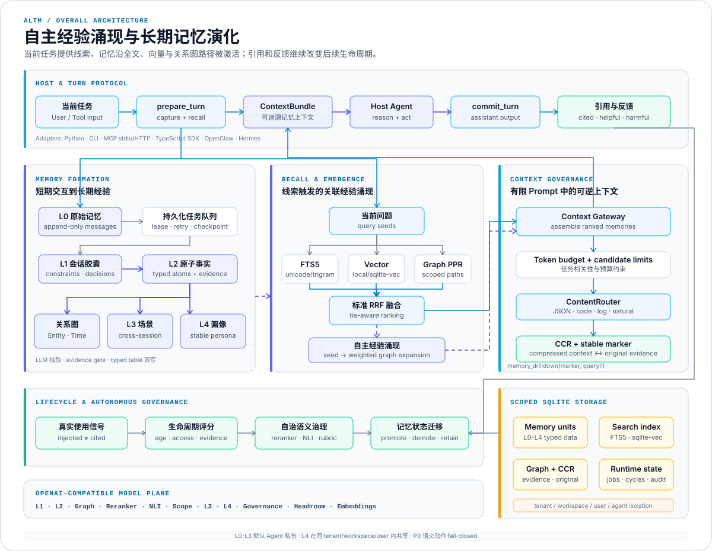
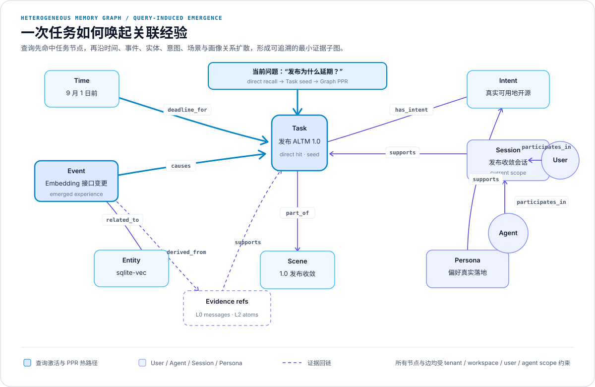

# ALTM: Autonomous Long-Term Memory

<div align="center">

**具备自主经验涌现与上下文治理能力的 Agent 长期记忆系统**

[](https://github.com/cuiyuestar/Autonomous-Long-Term-Memory-System)
[](https://www.python.org/)
[](https://github.com/cuiyuestar/Autonomous-Long-Term-Memory-System/actions/workflows/ci.yml)
[](https://modelcontextprotocol.io/)
[](LICENSE)

[DeepSeek Harness](#deepseek-harness) · [架构](#架构) · [核心能力](#核心能力) · [快速开始](#快速开始) · [Agent 接入](#agent-接入) · [MCP](#mcp-接入) · [评估](#评估)

</div>

---

> **公告：ALTM 现已支持 DeepSeek Harness 插件化接入。** `@altm/deepseek-harness` 是独立于 Harness 源码的 Cordis bundle，可以安装、热启用、热停用和完整卸载。它不修改 agent loop，也不替换 Harness SessionEvent 日志、持久化、重放或 compaction；ALTM 作为可替换的长期记忆能力，为原生会话增加跨轮、跨会话召回和自主经验涌现。
>
> [功能介绍](#deepseek-harness) · [快速入门](#deepseek-harness-插件)

ALTM 是一个面向 Agent 的自主长期记忆系统。它借鉴海马体的线索触发式回忆机制：Agent 执行任务时，当前问题会激活直接相关的历史记忆，并沿 Entity、Event、Task、Intent、Time 等关系继续扩散，让未被关键词或向量检索直接命中的关联经验随任务语境涌现。每条记忆都保留来源证据、关系路径和召回评分，Agent 可以据此追溯经验来自哪里、为何在当前任务中出现。

每轮交互都是记忆演化的起点。原始消息以 L0 形式完整保存，随后依次折叠为 L1 会话胶囊、L2 原子事实、L3 跨会话场景和 L4 稳定用户画像。Agent 的真实引用与用户反馈会持续写回生命周期，驱动记忆晋升、降级、压缩、保留和淘汰，形成从短期交互到长期经验的完整升级链路。

上下文治理发生在记忆进入 Prompt 之前。Context Gateway 按任务相关性和 token 预算组织候选内容，ContentRouter 分别处理 JSON、代码、日志和自然语言；CCR 同时保存压缩表示与完整原文，并通过稳定 marker 支持按需下钻。Agent 因此可以先使用紧凑上下文完成推理，在需要核验细节时再取回原始证据。

运行时通过两种终态嵌入任意 Host Agent：

```text
prepare_turn -> Host Agent 生成回复 -> commit_turn
             -> Host turn 未完成   -> abort_turn
```

`prepare_turn` 捕获用户输入并返回 `ContextBundle`。`commit_turn` 保存真实 Assistant 回复、实际引用和反馈；`abort_turn` 终止无法提交回复的 prepared cycle。ALTM 不代理 Host Agent 的推理过程。

## 能力概览

| 能力 | 当前实现 |
|---|---|
| 分层记忆 | L0 原文、L1 会话胶囊、L2 原子事实、L3 场景、L4 稳定画像 |
| 自主经验形成 | 后台任务从持续交互中抽取事实、关系、跨会话场景和 Persona Facet |
| 自主经验涌现（查询诱导） | 从直接命中的记忆出发，沿经验关系图扩展，找回关键词和向量检索未直接命中的关联经验 |
| 混合召回 | FTS5、local vector、OpenAI-compatible embedding、sqlite-vec、Graph PPR、标准 RRF |
| CCR 上下文治理 | 按内容类型压缩，保存原文与压缩版本，通过稳定 marker 按需下钻 |
| 自治治理 | LLM Rubric 驱动的语义去重、L3/L4 形成、冲突判断和高置信覆盖 |
| 生命周期 | 引用与反馈回写、晋升、降级、压缩、保留、删除、证据修复 |
| 多 Agent 隔离 | `tenant_id / workspace_id / user_id / agent_id` 四级 scope |
| 接入方式 | Python、CLI、MCP、TypeScript SDK、DeepSeek Harness、OpenClaw、Hermes |
| 本地持久化 | SQLite WAL、FTS5、sqlite-vec、持久化任务队列和 checkpoint |

## 架构

<p align="center">
  <a href="docs/assets/altm-overall-architecture.svg">
    
  </a>
</p>

Python 3.11+ 承担领域逻辑和持久化。TypeScript 与各 Host adapter 只处理生命周期映射和协议调用。

### 记忆层级

| 层级 | 内容 | 形成方式 | 默认可见范围 |
|---|---|---|---|
| L0 | 用户、Assistant、Tool 原始消息 | append-only capture | 当前 Agent |
| L1 | 会话上下文胶囊 | 增量 LLM summarization | 当前 Agent |
| L2 | preference、decision、issue、task 等原子事实 | 结构化 LLM extraction | 当前 Agent |
| L3 | 项目、任务、主题、关系和工作流场景 | 候选召回 + 多模型 Gate | 当前 Agent |
| L4 | 稳定用户画像 Persona Facet | 跨 session/Agent 证据 + observation | 同用户工作区 |

L0-L3 隔离到 `agent_id`。L4 只在相同 `tenant_id / workspace_id / user_id` 内共享。

## 核心能力

### 自主经验形成与治理

每轮交互先落入 L0，持久化 worker 再执行以下任务链：

```text
fold_l1
  -> extract_l2
     -> index_embeddings
     -> graph_extract
        -> semantic_l3
           -> semantic_l4
              -> lifecycle
              -> retention
```

- L1 保留会话约束、决策、修正和未决问题。
- L2 将内容拆成带来源证据的 typed atoms。
- Graph LLM 提取 Entity、Event、Task、Intent、Time 等节点及类型化关系。
- L3 聚合跨消息、跨会话的项目与任务场景。
- L4 从跨 session 或跨 Agent 的稳定证据中形成 Persona Facet。
- reranker、NLI、scope classifier 和层级 Rubric 并行评估候选。
- 语义模型缺失、输出非法或置信度不足时，相关动作进入 `defer`。
- L4 更新使用稳定 `facet_key`。高置信新证据触发版本化 supersede，旧版本、写前快照和 `SUPERSEDES` 证据链继续保留。

自治治理记录 evaluated、decided、applied、degraded 和 rollback 事件。管理端可以预览决策或按目标回滚。

### 自主经验涌现（查询诱导）

直接召回依赖查询文本与历史内容的显式匹配。很多经验之间存在因果、依赖、时间或任务关系，但关联节点本身不包含当前查询词。ALTM 通过 `QueryEmergenceEngine` 从直接命中扩展到这些关联经验。

执行过程：

1. 使用混合检索选取最多 `seed_limit` 个入口记忆。
2. 读取当前 scope 内已形成的 memory graph。
3. 过滤 rejected edge、已删除记忆及不符合 layer/status/session 条件的节点。
4. 按 edge weight 和 confidence 进行有限跳数的 PPR-style 传播。
5. 将图分数与记忆生命周期分数结合，返回关联经验及 `matched_by`、score breakdown 和解释字段。

例如，“发布为什么延期”直接命中一个 deadline 节点后，可以继续找到与它相连的依赖变更、历史决策和阻塞事件。扩展路径受 `max_hops` 和 scope 约束。

<p align="center">
  <a href="docs/assets/altm-heterogeneous-memory-graph.svg">
    
  </a>
</p>

```bash
.venv/bin/altm emerge \
  --db ./data/altm.sqlite3 \
  --query "发布为什么延期" \
  --seed-limit 8 \
  --max-hops 2 \
  --limit 10
```

Admin MCP profile 提供同一能力：

```text
memory_emerge(query, seed_limit=8, max_hops=2, limit=10)
```

当前实现将经验涌现用于扩展召回结果，执行过程不写入新的事实。图节点和关系由前置 Graph extraction 任务形成；被拒绝的关系不参与传播，其余关系按 weight 和 confidence 分配影响力。

### CCR 上下文治理

CCR（Compressed Content Retrieval）负责管理“Prompt 中的紧凑表示”和“存储中的完整证据”之间的映射。它解决三个具体问题：

- 长代码、日志、JSON 和自然语言历史持续占用 Prompt 预算；
- 一次性摘要会丢失标识符、异常路径和局部细节；
- Agent 发现线索后，需要回到原文验证，而非依赖压缩文本继续推断。

Context Gateway 为每条候选记忆分配预算，`ContentRouter` 根据内容类型选择策略：

| 内容类型 | 压缩策略 | 保留重点 |
|---|---|---|
| JSON | 结构裁剪、深度限制、数组采样 | key、层级和省略数量 |
| 代码 | 声明与信号行提取 | import、类型、函数、异常、TODO |
| 日志 | 信号筛选与去重 | ERROR、WARN、异常栈和失败行 |
| 自然语言 | `ALTM_HEADROOM_LLM_*` | 决策、约束、修正、数字、路径和风险 |

每次路由都会生成内容寻址 marker：

```text
memory://<memory_id>#<content_hash_prefix>
```

SQLite `ccr_entries` 同时保存原文、压缩文本、内容类型、策略和 marker。Prompt 可以只携带紧凑内容与 marker；Agent 需要证据细节时调用：

```text
memory_drilldown(marker="memory://<id>#<hash>")
memory_drilldown(marker="memory://<id>#<hash>", query="ERROR")
```

无 `query` 时返回对应原文；带 `query` 时额外返回最多 50 行匹配内容。marker 编码 memory ID 与 content hash，读取时还会按当前 scope 过滤，因而可以定位具体内容版本并阻断跨 scope 下钻。

自然语言压缩模型不可用时，Gateway 只注入 marker，把原文留在 CCR 中，不生成规则摘要。JSON、代码和日志使用确定性结构压缩。

### 混合召回与图推理

- FTS5 同时维护 `unicode61` 与 trigram 索引。
- local lexical vector 为无远程 embedding 的精确召回路径提供支持。
- OpenAI-compatible embedding 写入按模型和维度隔离的 sqlite-vec 索引。
- Graph retriever 执行 scoped Personalized PageRank，并返回最短支持路径。
- remote vector、local vector、FTS 和 Graph PPR 使用标准 Reciprocal Rank Fusion 合并。
- 相同 `content_hash` 的结果按并列名次计算 RRF，状态字段不会制造隐式分差。

### 生命周期与反馈闭环

- `injected` 只代表记忆进入本轮上下文。
- `cited_by_agent` 由 Host Agent 显式提交，代表本轮真实使用。
- helpful/harmful 反馈进入 lifecycle event。
- promotion/demotion 结合年龄、连续周期、证据质量、冲突状态和实际使用。
- C0-C4 记录压缩生命周期，CCR 提供可逆下钻。
- L0 默认永久保留，也支持 TTL、用户删除和法规删除。
- 删除流程处理 tombstone、物理删除及失效 evidence 的 fallback repair。

### 运行时一致性

- `prepare_turn` 原子写入用户消息、召回上下文和 runtime cycle。
- `commit_turn` 校验 cycle 状态及引用 ID，引用必须来自本轮 prepared context。
- `abort_turn` 在失败、无最终回复或 Host 插件卸载时将 cycle 终止为 aborted。
- 相同幂等键和相同内容可以安全重试；内容冲突会被拒绝。
- SQLite job queue 提供 lease、retry、dedupe 和 checkpoint。
- WAL、busy timeout 和事务边界用于多 worker 协调。

## 快速开始

### 环境要求

| 依赖 | 要求 |
|---|---|
| Python | 3.11 或更高 |
| SQLite | 支持 FTS5 |
| Chat API | OpenAI-compatible |
| Embedding API | OpenAI-compatible |
| MCP | 可选，安装 `mcp` extra |

### 安装

```bash
git clone https://github.com/cuiyuestar/Autonomous-Long-Term-Memory-System.git
cd Autonomous-Long-Term-Memory-System

python3.11 -m venv .venv
.venv/bin/python -m pip install -e ".[mcp]"

cp .env.example .env
```

配置共享 Chat Model 与 Embedding Model：

```bash
export ALTM_LLM_BASE_URL="https://provider.example.com/v1"
export ALTM_LLM_API_KEY="your-api-key"
export ALTM_LLM_MODEL="your-chat-model"

export ALTM_EMBEDDING_BASE_URL="https://provider.example.com/v1"
export ALTM_EMBEDDING_API_KEY="your-api-key"
export ALTM_EMBEDDING_MODEL="your-embedding-model"
```

初始化数据库：

```bash
.venv/bin/altm init-db --db ./data/altm.sqlite3
```

配置全集见 [.env.example](.env.example)。留空的阶段级模型配置会继承 `ALTM_LLM_*`。

### DeepSeek Harness 插件

完成上述 ALTM 安装后，将 DeepSeek Harness 放在 ALTM 的同级目录。插件还需要 Node.js ^22.19 或 >=24、Corepack、`jq` 和 `curl`：

```bash
cd ..
git clone https://github.com/deepseek-ai/deepseek-harness.git
cd Autonomous-Long-Term-Memory-System

mkdir -p data
cp .env.example data/altm-harness.env
chmod 600 data/altm-harness.env
```

在 `data/altm-harness.env` 中配置：

| 变量 | 用途 |
|---|---|
| `DSH_HOME` | Harness profile 和凭证目录，推荐使用 ALTM 仓库下 `data/dsh-home` 的绝对路径 |
| `DEEPSEEK_API_KEY` | Harness 模型凭证 |
| `ALTM_LLM_BASE_URL`、`ALTM_LLM_API_KEY`、`ALTM_LLM_MODEL` | ALTM L1/L2/Graph/Governance 使用的 OpenAI-compatible Chat API |
| `ALTM_MCP_API_KEY` | Harness Provider 连接 ALTM MCP 使用的随机明文 Key |
| `ALTM_MCP_API_KEY_SHA256` | 上述 MCP Key 的 SHA-256；服务端使用该值验证请求 |

以下命令计算 MCP Key 的哈希，不会输出明文：

```bash
printf '%s' "$ALTM_MCP_API_KEY" | shasum -a 256
```

启动完整环境：

```bash
./scripts/altm-harness-stack.sh start
./scripts/altm-harness-stack.sh status
```

状态应包含 `plugin=enabled`、`mcp=running`、`worker=running` 和 `web=running`。打开 [http://127.0.0.1:3000](http://127.0.0.1:3000)，正常对话即可自动写入和召回记忆；Memory 标签用于查看当前会话 scope 下的 Graph 与 L1-L4。

常用生命周期命令：

```bash
./scripts/altm-harness-stack.sh disable   # 热停用，不重启 Web
./scripts/altm-harness-stack.sh enable    # 热启用，不重启 Web
./scripts/altm-harness-stack.sh restart
./scripts/altm-harness-stack.sh logs
./scripts/altm-harness-stack.sh stop
./scripts/altm-harness-stack.sh uninstall
./scripts/altm-harness-stack.sh install
```

验证记忆时，第一轮声明一个独特事实，第二轮要求仅根据记忆回答并附带同一个 `memory://` marker。DeepSeek Chat 可驱动 Harness 和 ALTM 的 L1/L2/Graph；完整 L3/L4 语义晋升还需要另行配置 OpenAI-compatible Embedding API。

## Agent 接入

### Python

```python
from altm.application import AltmApplication

app = AltmApplication("./data/altm.sqlite3")

prepared = app.prepare_turn(
    tenant_id="tenant-1",
    workspace_id="workspace-1",
    user_id="user-1",
    agent_id="agent-1",
    session_id="session-1",
    turn_id="turn-1",
    content="我们决定在 9 月 1 日前发布 ALTM。",
    token_budget=1200,
)

# Host Agent 使用 prepared.context 完成自己的模型调用。
assistant_content = host_agent.generate(prepared.context)

app.commit_turn(
    tenant_id="tenant-1",
    workspace_id="workspace-1",
    user_id="user-1",
    agent_id="agent-1",
    cycle_id=prepared.cycle_id,
    assistant_content=assistant_content,
    cited_memory_ids=host_agent.cited_memory_ids,
)
```

`cited_memory_ids` 只提交本轮实际使用的记忆 ID。

### CLI

Prepare：

```bash
.venv/bin/altm prepare-turn \
  --db ./data/altm.sqlite3 \
  --tenant-id tenant-1 \
  --workspace-id workspace-1 \
  --user-id user-1 \
  --agent-id agent-1 \
  --session-id session-1 \
  --turn-id turn-1 \
  --content "我们决定在 9 月 1 日前发布 ALTM。"
```

Commit：

```bash
.venv/bin/altm commit-turn \
  --db ./data/altm.sqlite3 \
  --tenant-id tenant-1 \
  --workspace-id workspace-1 \
  --user-id user-1 \
  --agent-id agent-1 \
  --cycle-id "<cycle_id>" \
  --assistant-content "发布截止日期是 9 月 1 日。" \
  --cited-memory-id "<实际引用的 memory_id>"
```

运行后台 worker：

```bash
.venv/bin/altm worker \
  --db ./data/altm.sqlite3 \
  --worker-id worker-1
```

生产部署需要持续运行一个或多个 worker。多个进程通过 SQLite lease 领取任务。

## MCP 接入

### 本地 stdio

```bash
.venv/bin/altm mcp-server \
  --db ./data/altm.sqlite3 \
  --transport stdio \
  --profile runtime
```

MCP Client 配置：

```json
{
  "mcpServers": {
    "altm": {
      "command": "/absolute/path/to/.venv/bin/altm",
      "args": [
        "mcp-server",
        "--db",
        "/absolute/path/to/data/altm.sqlite3",
        "--transport",
        "stdio",
        "--profile",
        "runtime"
      ]
    }
  }
}
```

Runtime profile 暴露：

```text
memory_prepare_turn
memory_commit_turn
memory_abort_turn
memory_mvp_chat
memory_drilldown
memory_feedback
memory_pin
memory_unpin
memory_delete
```

`memory_mvp_chat` 是兼容入口；新接入使用 prepare/commit。经验涌现、治理、索引和回滚工具位于 `--profile admin`。

### Streamable HTTP

服务端保存 API Key 的 SHA-256：

```bash
export ALTM_MCP_API_KEY_SHA256="$(
  printf '%s' 'your-runtime-secret' | shasum -a 256 | awk '{print $1}'
)"

.venv/bin/altm mcp-server \
  --db ./data/altm.sqlite3 \
  --transport streamable-http \
  --profile runtime \
  --host 127.0.0.1 \
  --port 8000
```

多 Key 与 scope 使用 `ALTM_MCP_API_KEYS_JSON`。OIDC/JWT 可通过 `ALTM_MCP_TOKEN_VERIFIER_FACTORY=module.path:factory` 接入。

协议状态、幂等语义和失败处理见 [Agent Runtime Protocol](docs/agent-runtime-protocol.md)。

## Host 适配器

### TypeScript SDK

[`adapters/typescript`](adapters/typescript) 提供 `@altm/sdk`：

```typescript
import {
  AltmRuntimeClient,
  AltmTurnCoordinator,
  StreamableHttpToolCaller
} from "@altm/sdk";

const caller = await StreamableHttpToolCaller.connect({
  url: "http://127.0.0.1:8000/mcp",
  apiKey: process.env.ALTM_API_KEY
});

const coordinator = new AltmTurnCoordinator(
  new AltmRuntimeClient(caller)
);

const turn = await coordinator.prepare({
  scope: {
    tenantId: "tenant-1",
    workspaceId: "workspace-1",
    userId: "user-1",
    agentId: "agent-1"
  },
  sessionId: "session-1",
  turnId: crypto.randomUUID(),
  content: "What is our release deadline?"
});

const answer = await hostAgent.generate(turn.injectedContext);
await coordinator.commit({
  prepared: turn.prepared,
  assistantContent: answer,
  citedMemoryIds: hostAgent.citedMemoryIds
});
```

### DeepSeek Harness

[`adapters/deepseek-harness`](adapters/deepseek-harness) 提供可安装的 `@altm/deepseek-harness` Cordis bundle，并拆分为 `LongTermMemory` Service Definition、ALTM MCP Provider、Harness Consumer、只读 UI Host 和 Web Client。Consumer 在首个已接纳的 `agent/pre-step` 调用 Provider，把 ContextBundle 作为带来源的持久 `user/message` 加入同一请求；最终 `turn/end` 后 commit，失败 turn 或插件卸载则 abort。

| 功能 | 行为 |
|---|---|
| 完整插件角色 | Service Definition、Provider、Consumer、只读 UI Host 和 Web Client 分离，可独立替换 Provider |
| 可靠回合协议 | `agent/pre-step` prepare，最终 `turn/end` commit；失败、无 Assistant 回复或卸载时 abort |
| 原生会话语义 | 召回内容以带来源的持久 `user/message` 进入 SessionEvent 日志，模型请求可恢复、可重放 |
| 热插拔 | `cordis:group` 同步管理 Provider、Consumer 和 UI Host，启停过程不重启 Harness Web |
| Memory 界面 | 提供 Graph 球状异构记忆图和 L1-L4 Layers 浏览器，支持中英文与响应式布局 |
| 安全与隔离 | 浏览器不接触 MCP Key 或 SQLite 路径；只读请求按 `tenant/workspace/user/agent` scope 查询 |

bundle 使用 `cordis:group` 统一热启停 Provider、Consumer 与 UI Host，也允许其他 Provider 实现相同 Service Definition。它不替换 Harness SessionEvent 日志，不修改 Harness agent loop 或 ALTM 记忆形成逻辑。API Key 通过 Harness credentials service 或环境变量引用解析，`tenantId / workspaceId / userId / agentId` 保持 ALTM 四级隔离。安装与配置见 [adapter README](adapters/deepseek-harness/README.md)，真实 Loader + MCP 结果见[接入测试报告](docs/deepseek-harness-integration-report.md)。

### OpenClaw

[`adapters/openclaw`](adapters/openclaw) 映射两个生命周期事件：

```text
before_prompt_build -> memory_prepare_turn
agent_end           -> memory_commit_turn
```

adapter 支持 MCP endpoint、API Key、稳定 scope 和 incognito session 跳过。本仓库只维护 adapter 源码与 manifest；运行兼容性需要在允许安装 OpenClaw 的环境验证。

### Hermes

先将 ALTM 注册为 Hermes MCP Server：

```yaml
mcp_servers:
  altm:
    url: "http://127.0.0.1:8000/mcp"
    headers:
      Authorization: "Bearer ${ALTM_API_KEY}"
    tools:
      include:
        - memory_prepare_turn
        - memory_commit_turn
```

安装 [`adapters/hermes`](adapters/hermes)：

```bash
cp -R adapters/hermes ~/.hermes/plugins/altm-memory
hermes plugins enable altm-memory
```

插件在 `pre_llm_call` 注入 ContextBundle，在 `post_llm_call` 提交 Assistant 回复和真实 marker 引用。

## 模型配置

所有模型接口使用 OpenAI-compatible API。阶段级配置留空时继承共享配置。

| 阶段 | 环境变量前缀 | 职责 |
|---|---|---|
| L1 | `ALTM_L1_LLM_*` | 会话上下文胶囊 |
| L2 | `ALTM_L2_LLM_*` | 原子事实抽取 |
| Graph | `ALTM_GRAPH_LLM_*` | Entity/Event/Task/Intent/Time 图 |
| Governance | `ALTM_GOVERNANCE_LLM_*` | 自治治理裁决 |
| Reranker | `ALTM_RERANKER_LLM_*` | 语义候选重排 |
| NLI | `ALTM_NLI_LLM_*` | entail/contradict/neutral |
| Scope | `ALTM_SCOPE_LLM_*` | session/project/workspace 边界 |
| L3 | `ALTM_L3_LLM_*` | Scene Rubric 与合成 |
| L4 | `ALTM_L4_LLM_*` | Persona Rubric、合成与覆盖 |
| Headroom | `ALTM_HEADROOM_LLM_*` | 自然语言压缩 |

关键运行参数：

| 变量 | 默认值 | 说明 |
|---|---:|---|
| `ALTM_SEMANTIC_MIN_SCORE` | `0.80` | 语义 Gate 最低置信度 |
| `ALTM_L4_OVERWRITE_MIN_CONFIDENCE` | `0.90` | L4 覆盖阈值 |
| `ALTM_L0_RETENTION_DAYS` | `0` | `0` 表示永久保留 |
| `ALTM_LONG_MEMORY_TOKEN_BUDGET` | `100000` | 长期记忆预算 |
| `ALTM_CONTEXT_TOKENIZER` | `tiktoken` | 精确 token 预算器 |

## 数据与安全边界

1. 每个 `MemoryUnit` 都携带完整 scope。
2. L4 共享不改变 L0-L3 的 Agent 私有边界。
3. stdio 面向本地可信进程；SSE 和 Streamable HTTP 强制认证。
4. Client 持有 API Key 明文，服务端只保存 SHA-256。
5. 记忆以不可信历史证据进入 Prompt，不具备系统指令权限。
6. P0 语义治理采用 fail-closed；模型缺失时不会执行合并、覆盖或删除。
7. 删除操作记录 request、tombstone、物理删除和 evidence repair。
8. CCR marker 编码 memory ID 与 content hash，下钻查询按当前 scope 过滤。

安全问题请按 [SECURITY.md](SECURITY.md) 私下报告。

## 评估

内置数据适配器支持：

- LongMemEval；
- LoCoMo；
- HMAC 匿名化真实 Agent trace。

运行 LongMemEval 召回评估：

```bash
.venv/bin/altm-benchmark run \
  --format longmemeval \
  --dataset /approved/path/longmemeval_s_cleaned.json \
  --db ./data/benchmark.sqlite3 \
  --output ./reports/longmemeval.json \
  --top-k 5 \
  --top-k 10 \
  --enrichment l0
```

`--enrichment l0` 只写入原始记忆。`l2` 和 `full` 会调用对应的真实模型链，缺少配置时终止评估。

报告包含 Recall-any@K、Recall-all@K、nDCG@K、MRR、p50/p95/p99 延迟、数据集 SHA-256、分类汇总和逐题证据。仓库不下载或分发评估数据集。方法与 trace 脱敏规则见 [Evaluation Guide](docs/evaluation.md)。

## 项目结构

```text
.
├── src/altm/
│   ├── capture/          # L0 append-only capture
│   ├── folding/          # L1/L2/Graph/L3/L4
│   ├── retrieval/        # FTS/vector/RRF/PPR/experience emergence
│   ├── context/          # ContextBundle/Headroom/CCR
│   ├── lifecycle/        # promotion/demotion/retention/compression
│   ├── governance/       # autonomous semantic governance
│   ├── evaluation/       # LongMemEval/LoCoMo/anonymous trace
│   ├── storage/          # scoped SQLite/jobs/checkpoints
│   └── adapters/mcp/     # runtime/admin MCP profiles
├── adapters/
│   ├── typescript/       # @altm/sdk
│   ├── deepseek-harness/ # DeepSeek Harness Cordis bundle
│   ├── openclaw/         # OpenClaw lifecycle adapter
│   └── hermes/           # Hermes hooks adapter
├── schemas/sqlite/       # packaged SQLite schema
├── docs/                 # protocol and evaluation guides
└── tests/                # unit and integration tests
```

## 开发与验证

```bash
.venv/bin/python -m compileall -q src tests adapters/hermes adapters/deepseek-harness/tests
.venv/bin/ruff check src tests adapters/hermes adapters/deepseek-harness/tests/run_e2e.py
.venv/bin/pyright
.venv/bin/python -m unittest discover -s tests -v
sqlite3 :memory: ".read schemas/sqlite/001_initial.sql"
.venv/bin/python -m build

(cd adapters/typescript && npm ci && npm run typecheck && npm run build)
(cd adapters/deepseek-harness && npm ci && npm run typecheck && npm test)
```

当前验证基线：

```text
160 tests passed
Ruff passed
Strict Pyright: 0 errors, 0 warnings
TypeScript SDK typecheck/build passed
DeepSeek Harness adapter tests/build passed
isolated Harness Loader + authenticated MCP E2E passed
sdist/wheel build passed
isolated Python 3.11 wheel initialization passed
Streamable HTTP auth: invalid 401 / valid initialize 200
```

## 1.0.0 边界

1.0.0 已覆盖完整 runtime cycle、查询诱导的经验涌现、CCR、L4 supersede、C0-C4 压缩状态和本地 SQLite 持久化。以下项目尚未纳入发布承诺：

- 自动语义 scope split；
- 独立冷对象存储后端；
- OpenClaw runtime 兼容性实测结论；
- LongMemEval 与 LoCoMo 的公开全量性能数字。

## 贡献

提交 Issue 或 Pull Request 前请阅读 [CONTRIBUTING.md](CONTRIBUTING.md)。生产路径需要保持以下约束：

- LLM 缺失时不生成模拟语义结果；
- L0 原文与 evidence chain 保持可追溯；
- scope 隔离不可放宽；
- P0 治理动作 fail-closed；
- 测试、Ruff 和 Strict Pyright 通过。

## License

ALTM 使用 [Apache License 2.0](LICENSE)。
